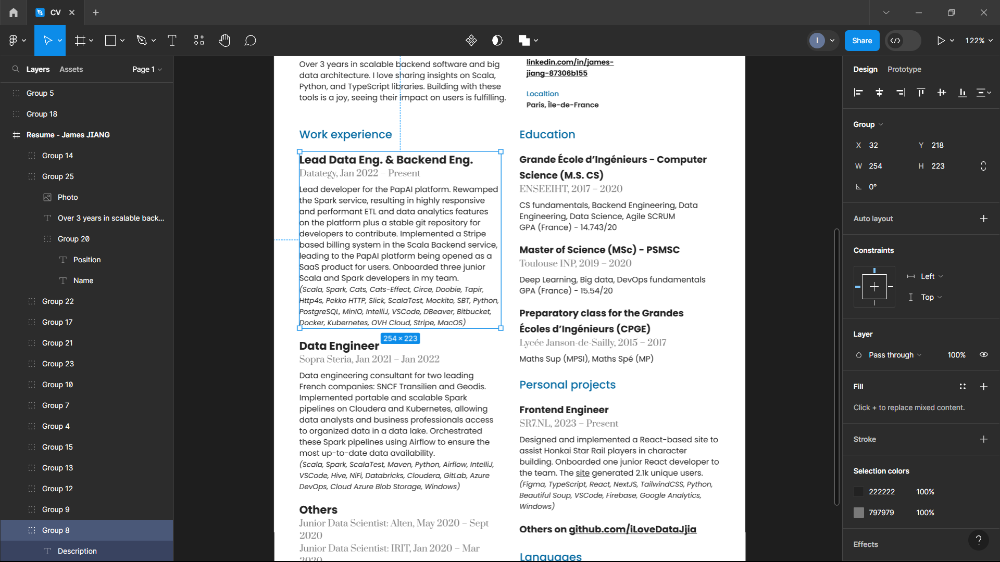

# CV - Free curriculum vitae template on Figma

🤑📄 Discover a free, Figma-based CV template now on GitHub. Created to assist in crafting your resume, this template offers a clean design and easy usability. Designed with simplicity in mind, it aims to help highlight your skills and experiences effectively.

## 🌈 Extract

The [link](https://github.com/iLoveDataJjia/cv/raw/main/CV.pdf) 😍 for the complete document in PDF format.

## 🚀 How to start

Please install [Figma](https://www.figma.com/).

For accessing the CV template just open `./CV.fig` using Figma.

